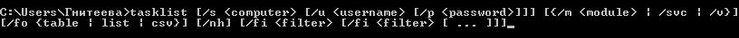

# УТИЛИТА TASKLIST КОМАНДНОЙ СТРОКИ CMD

## Техническое задание

# СОДЕРЖАНИЕ

1. [ВВЕДЕНИЕ](#1)  
   1.1. [Наименование](#1.1)  
   1.2. [Краткая характеристика области применения](#1.2)
2. [ОСНОВАНИЯ ДЛЯ РАЗРАБОТКИ](#2)  
   2.1. [Основания для проведения разработки](#2.1)  
   2.2. [Наименование и условное обозначение темы разработки](#2.2)
3. [НАЗНАЧЕНИЕ РАЗРАБОТКИ](#3)  
   3.1. [Функциональное назначение](#3.1)  
   3.2. [Эксплуатационное назначение](#3.2)
4. [ТРЕБОВАНИЯ К ПРОГРАММЕ](#4)  
   4.1. [Требования к функциональным характеристикам](#4.1)  
   4.1.1. [Требования к составу выполняемых функций](#4.1.1)  
   4.1.2. [Требования к организации входных и выходных данных](#4.1.2)
   4.1.3. [Требования к временным характеристикам](#4.1.3)
   4.2 [Требования к надежности](#4.2)
   4.2.1. [Требования к обеспечению устойчивого функционирования](#4.2.1)
   4.2.2. [Контроль входной и выходной информации](#4.2.2)  
   4.2.3. [Время восстановления после отказа](#4.2.3)  
   4.3. [Условия эксплуатации](#4.3)  
   4.3.1. [Климатические условия эксплуатации](#4.3.1)  
   4.3.2. [Требования к видам обслуживания](#4.3.2)  
   4.3.3. [Требования к численности и квалификации персонала](#4.3.3)  
   4.4. [Требования к составу и параметрам технических средств](#4.4)  
   4.5. [Требования к информационной и программной совместимости](#4.5)  
   4.5.1. [Требования к информационным структурам и методам решения](#4.5.1)  
   4.5.2. [Требования к исходным кодам и языкам программирования](#4.5.2)  
   4.5.3. [Требования к программным средствам, используемых программой](#4.5.3)  
   4.5.4. [Требования к защите информации и программ](#4.5.4)  
   4.6. [Требования к маркировке и упаковке](#4.6)  
   4.7. [Требования к транспортированию и хранению](#4.7)  
   4.8. [Специальные требования](#4.8)
5. [ТРЕБОВАНИЯ К ПРОГРАММНОЙ ДОКУМЕНТАЦИИ](#5)  
   5.1. [Предварительный состав программной документации](#5.1)  
   5.2. [Специальные требования к программной документации](#5.2)
6. [ТЕХНИКО-ЭКОНОМИЧЕСКИЕ ПОКАЗАТЕЛИ](6)  
   6.1. [Ориентировочная экономическая эффективность](#6.1)  
   6.2. [Предполагаемая годовая потребность](#6.2)  
   6.3. [Экономические преимущества разработки](#6.3)
7. [СТАДИИ И ЭТАПЫ РАЗРАБОТКИ](#7)  
   7.1. [Стадии разработки](#7.1)  
   7.2. [Этапы разработки](#7.2)  
   7.3. [Содержание работ по этапам](#7.3)
8. [ПОРЯДОК КОНТРОЛЯ И ПРИЕМКИ](#8)  
   8.1. [Виды испытаний](#8.1)  
   8.2. [Общие требования к приемке работы](#8.2)

# <a name = "1"> 1. ВВЕДЕНИЕ </a>

---

## <a name = "1.1"> 1.1. Наименование </a>

---

Наименование – «Утилита TASKLIST командной строки CMD».

## <a name = "1.2"> 1.2. Краткая характеристика области применения </a>

---

Утилита TASKLIST используется для получения списка процессов, выполняющихся на локальном или удаленном компьютере в данный момент времени.

# <a name = "2"> 2. ОСНОВАНИЯ ДЛЯ РАЗРАБОТКИ </a>

---

## <a name = "2.1"> 2.1. Основания для проведения разработки </a>

---

Основанием для проведения разработки является лабораторная работа №1 по дисциплине «Технология разработки программного обеспечения АСОИУ». Лабораторная работа утверждена Сувальским А.А., в дальнейшем именуемым Заказчиком. Дата утверждения 09.10.20.

## <a name = "2.2"> 2.2. Наименование и условное обозначение темы разработки </a>

---

Наименование темы разработки – «Разработка утилиты TASKLIST».  
Условное обозначение темы разработки – «A.B.00001».

# <a name = "3"> 3. НАЗНАЧЕНИЕ РАЗРАБОТКИ </a>

---

## <a name = "3.1"> 3.1. Функциональное назначение </a>

---

Функциональным назначением утилиты является отображение списка приложений и служб с кодом процесса (PID) для всех задач, выполняющихся на локальном или удаленном компьютере.

## <a name = "3.2"> 3.2. Эксплуатационное назначение </a>

---

Утилита TASKLIST должна эксплуатироваться в интерпретаторе командной строки CMD или в пакетном файле.

# <a name = "4"> 4. ТРЕБОВАНИЯ К ПРОГРАММЕ </a>

---

## <a name = "4.1"> 4.1. Требования к функциональным характеристикам </a>

---

### <a name = "4.1.1"> 4.1.1. Требования к составу выполняемых функций </a>

---

Утилита TASKLIST должна обеспечивать возможность выполнения перечисленных ниже функций:

1. функция отображения списка служб;

### <a name = "4.1.2"> 4.1.2. Требования к организации входных и выходных данных </a>

---

4.1.2.1. Утилита TASKLIST должна иметь синтаксис, изображенный на рис.1.

Рис. 1 – Общий синтаксис команды TASKLIST

Здесь используются:

- _/s <computer>_ – указывает имя или IP-адрес удаленного компьютера, по умолчанию это локальный компьютер;
- _/u <username>_ – выполняет команду с разрешениями учетной записи пользователя, заданного пользователем;
- _/p <password>_ – указывает пароль учетной записи пользователя, указанной в параметре /u;
- _/m <module>_ – cписок всех задач с загруженными модулями DLL, которые соответствуют заданному имени шаблона;
- _SVC_ – cписок всех сведений о службе для каждого процесса без усечения;
- _/v_ – oтображает подробные сведения о задаче в выходных данных;
- _/fo {table | list | csv}_ – указывает формат, используемый для выходных данных, допустимые значения: Table, List и CSV;
- _/fi <filter>_ – указывает типы процессов, включаемых в запрос или исключаемых из него.

4.1.2.2. Команда TASKLIST допускает применение следующих фильтров  (в первой колонке указано название фильтра, во второй допустимые операторы, в третьей допустимые значения):

1. **STATUS** - _eq, ne_ – RUNNING | NOT RESPONDING | UNKNOWN;
2. **IMAGENAME** - _eq, ne_ – имя образа;
3. **PID** - _eq, ne, gt, lt, ge, le_ – значение PID;
4. **SESSION** - _eq, ne, gt, lt, ge, le_ – номер сессии;
5. **SESSIONNAME** - _eq, ne_ – имя сессии;
6. **CPUTIME** - _eq, ne, gt, lt, ge, le_ – время CPU в формате hh:mm:ss, где hh - часы, mm - минуты, ss - секунды;
7. **MEMUSAGE** - _eq, ne, gt, lt, ge, le_ – использование памяти в KБ;
8. **USERNAME** - _eq, ne_ – имя пользователя;
9. **SERVICES** - _eq, ne_ – имя службы;
10. **WINDOWTITLE** - _eq, ne_ – название окна;
11. **MODULES** - _eq, ne_ – имя DLL;

### <a name = "4.1.3"> 4.1.3. Требования к временным характеристикам </a>

---

Требования к временным характеристикам программы не предъявляются.

## <a name = "4.2"> 4.2. Требования к надежности </a>

---

### <a name = "4.2.1"> 4.2.1. Требования к обеспечению устойчивости функционирования </a>

---

Надежное (устойчивое) функционирование программы должно быть обеспечено выполнением совокупности организационно-технических мероприятий:

1. организацией бесперебойного питания технических средств;
2. выполнением рекомендаций Министерства труда и социального развития РФ, изложенных в Постановлении от 23 июня 1998 г. «Об утверждении межотраслевых типовых норм времени на работы по сервисному обслуживанию ПЭВМ и оргтехники и сопровождению программных средств»;
3. выполнением требований ГОСТ 51188-98. Защита информации. Испытания программных средств на наличие компьютерных вирусов;
4. необходимым уровнем квалификации сотрудников профильных подразделений.

### <a name = "4.2.2"> 4.2.2. Контроль входной и выходной информации </a>

---

В случае неправильного ввода команды TASKLIST, командная строка должна вывести сообщение.

### <a name = "4.2.3"> 4.2.3. Время восстановления после отказа </a>

---

Время восстановления после отказа должно не превышать 30 минут.

## <a name = "4.3"> 4.3. Условия эксплуатации </a>

---

### <a name = "4.3.1"> 4.3.1. Климатические условия эксплуатации </a>

---

Программа должна работать в закрытых помещениях, при нормальных климатических условиях.  
Температура окружающего воздуха должна быть в диапазоне 20-25 градусов, относительная влажность на уровне 40-60%.

### <a name = "4.3.2"> 4.3.2. Требования к видам обслуживания </a>

---

Проводится периодическое тестирования программы, раз в полгода.

### <a name = "4.3.3"> 4.3.3. Требования к численности и квалификации персонала </a>

---

Минимальное количество персонала, требуемого для работы программы, должно составлять не менее двух штатных единиц – системный программист и конечный пользователь программы – оператор.  
Системный программист должен иметь минимум среднее техническое образование. В перечень задач, выполняемых системным программистом, должны входить:

1. задача поддержания работоспособности технических средств;
2. задача установки (инсталляции) и поддержания работоспособности системного программного средства – операционной системы;
3. задача установки (инсталляции) программы.

Конечный пользователь программы (оператор) должен обладать практическими навыками работы с графическим пользовательским интерфейсом операционной системы.

## <a name = "4.4"> 4.4. Требования к составу и параметрам технических средств </a>

---

В состав технических средств должен входить IBM-совместимый персональный компьютер (ПЭВМ), включающий в себя:

1. процессор Pentium – 4 с тактовой частотой не менее 300 МГц;
2. оперативную память объемом не менее 128 Мб;
3. жесткий диск объемом 1,5 Гб и выше.

## <a name = "4.5"> 4.5. Требования к информационной и программной совместимости </a>

---

### <a name = "4.5.1"> 4.5.1. Требования к информационным структурам и методам решения </a>

---

Требования к информационным структурам на входе и выходе, а также к методам решения не предъявляются.

### <a name = "4.5.2"> 4.5.2. Требования к исходным кодам и языкам программирования </a>

---

Исходные коды программы должны быть реализованы в пакетном файле или непосредственно в интерпретаторе командной строки CMD.

### <a name = "4.5.3"> 4.5.3. Требования к программным средствам, используемых программой </a>

---

Должна использоваться командная строка, встроенная в операционную систему Windows.

### <a name = "4.5.4"> 4.5.4. Требования к защите информации и программ </a>

---

Требования к защите информации и программ не предъявляются.

## <a name = "4.6"> 4.6. Требования к маркировке и упаковке </a>

---

Требования к маркировке и упаковке не предъявляются.

## <a name = "4.7"> 4.7. Требования к транспортированию и хранению </a>

---

Требования к транспортированию и хранению не предъявляются.

## <a name = "4.8"> 4.8. Специальные требования </a>

---

Специальные требования к программе не предъявляются.

# <a name = "5"> 5. ТРЕБОВАНИЯ К ПРОГРАММНОЙ ДОКУМЕНТАЦИИ </a>

---

## <a name = "5.1"> 5.1. Предварительный состав программной документации </a>

---

Состав программной документации должен включать в себя:

1. техническое задание;
2. спецификация;
3. текст программы;
4. описание программы;
5. программу и методики испытаний;
6. пояснительную записку;
7. ведомость эксплуатационных документов;
8. формуляр;
9. описание применения;
10. руководство системного программиста;
11. руководство программиста;
12. руководство оператора.

## <a name = "5.2"> 5.2. Специальные требования к программной документации </a>

---

Специальные требования к программной документации не предъявляются.

# <a name = "6"> 6. ТЕХНИКО-ЭКОНОМИЧЕСКИЕ ПОКАЗАТЕЛИ </a>

---

## <a name = "6.1"> 6.1. Ориентировочная экономическая эффективность </a>

---

Ориентировочная экономическая эффективность не рассчитывается.

## <a name = "6.2"> 6.2. Предполагаемая годовая потребность </a>

---

Предполагаемая годовая потребность не рассчитывается.

## <a name = "6.3"> 6.3. Экономические преимущества разработки </a>

---

Экономические преимущества разработки не рассчитываются.

# <a name = "7"> 7. СТАДИИ И ЭТАПЫ РАЗРАБОТКИ </a>

---

## <a name = "7.1"> 7.1. Стадии разработки </a>

---

Разработка должна быть предъявлена в три стадии:

1. разработка технического задания;
2. рабочее проектирование;
3. внедрение.

## <a name = "7.2"> 7.2. Этапы разработки </a>

---

На стадии разработки технического задания должен быть выполнен этап разработки, согласования и утверждения с Заказчиком и Исполнителем настоящего технического задания.

На стадии рабочего проектирования должны быть выполнены следующие этапы работ:

1. разработка программы;
2. разработка программной документации;
3. испытания программы.

На стадии внедрения должен быть выполнен этап разработки – подготовка и передача программы.

## <a name = "7.3"> 7.3. Содержание работ по этапам </a>

---

На этапе разработки технического задания должны быть выполнены следующие виды работ:

1. постановка задачи;
2. определение и уточнение требований к техническим средствам;
3. определение требований к программе;
4. определение стадий, этапов и сроков разработки программы и документации на неё;
5. выбор языков программирования;
6. согласование и утверждение технического задания.

На этапе разработки программы должна быть выполнена работа программированию и отладке программы.

На этапе разработки программной документации должна быть выполнена разработка программных документов в соответствии с требованиями ГОСТ 19.101-77 и требованием п. «Предварительный состав программной документации» настоящего технического задания.

На этапе испытаний программы должны быть выполнены следующие виды работ:

1. разработка, согласование и утверждение программы и методики испытаний;
2. проведение приёмо-сдаточных испытаний;
3. корректировка программы и программной документации по результатам испытаний.
   На этапе подготовки и передачи программы должна быть выполнена подготовка и передача программы и программной документации в эксплуатацию на объектах Заказчика.

# <a name = "8"> 8. ПОРЯДОК КОНТРОЛЯ И ПРИЕМКИ </a>

---

## <a name = "8.1"> 8.1. Виды испытаний </a>

---

Приемо-сдаточные испытания программы должны проводиться согласно разработанной Исполнителем и согласованной Заказчиком «Программы и методики испытаний».

Ход проведения приемо-сдаточных испытаний Заказчик и Исполнитель документируют в Протоколе проведения испытаний.

## <a name = "8.2"> 8.2. Общие требования к приемке работы </a>

---

После проведения испытаний в полном объеме, на основании «Протокола испытаний» утверждают «Свидетельство о приемке» и производят запись в программном документе «Формуляр».
